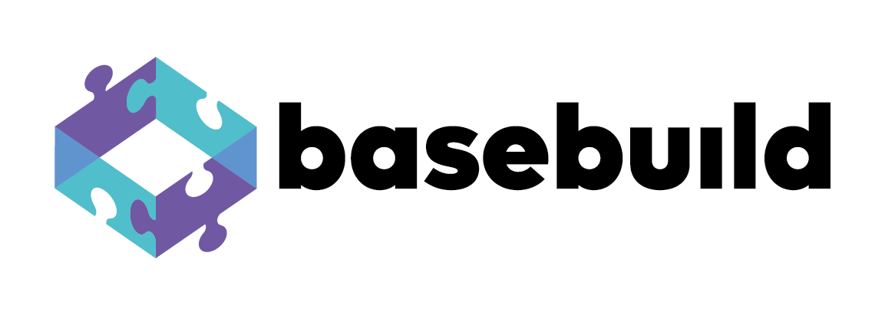
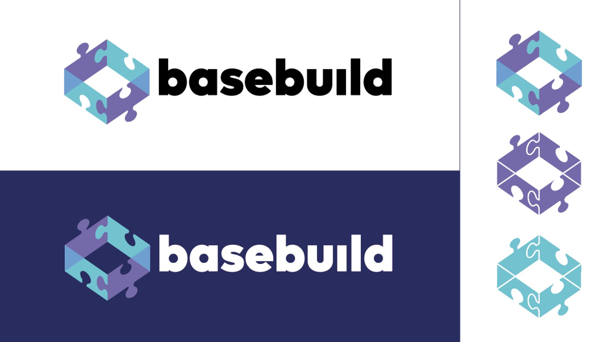

<p align="center">basebuild is the core project to build your own dev ecosystem.</p>
<p align="center">Write once, use everywhere at once! ;)</p>

# 📦 WHAT
> Centralizing all development environment and all build flux of multiple projects at once.

We're moving to a new approach, now we can create multiple ecosystems in the agnostic way.
basebuild will have strategies to different ecosystems and for now we're starting on Vite's context.

# 🧐 WHY
> Now you can create your own project's ecosystem based on your favorite module bundler settings.

<details>
  <summary>📚 More details about the concept</summary>
    Now we can move to the future on the fly. On the past road, we've past through Gulp's scripts as main resource to create a dev server and build system replicable, but module bundlers have been created and emerged in a surprising and dominant way as the most powerful frontend tool to evolve the present using future core features by loaders, plugins and etc.
    <p>
    So, we cannot guess how the future will be like, but we can be resilient with it. The basebuild's core module now have the mission to adapt configurations to different ecosystems of module bundlers in the recursive way and by different layers.
    </p>
    <p>
    
    So this way you can create your own project's ecosystem based on your favorite module bundler settings.
    </p>
    <strong>
    This means that you can create a node package centralizing all development environment and all build flux of multiple projects
    </strong>
    <p>
    <br />
    Some direct basebuildfieds projects will be created for open source community on Vite's ecosystem:
    <ul>
      <li>basebuild-web-extensions: Focus to develop browsers extensions (Mainly Chrome Extensions)</li>
      <li>basebuild-angular: Full rewrite of old package to Vite's system and Angular's apps development.</li>
      <li>basebuild-vue: Focus to develop Vue.js apps</li>
    </ul>
    </p>
    <p>
    This is limitless, so let's see what the community can do.
    </p>
  </p>
</details>
<br />

# Usage
## Vite's Ecosystem Example

`To only aggregate config objects or config functions`
```typescript
import basebuild from '@bebasebuild/basebuild'

basebuild({
  configSystem: 'vite',
  configs: [
    configFunction1,
    configObject2,
    configFunction3,
  ]
})
```

### Other Cases
<details>
  <summary>To create a basebuild child project like '@bebasebuild/basebuild-vue'</summary>

  ```typescript
    import basebuild from '@bebasebuild/basebuild'
    import vue from '@vitejs/plugin-vue'
    import { UserConfig } from 'vite'

    export const basebuildVue = (userConfig: UserConfig) => {

      const bbVueConfigFn = ({ command, basebuildDefaults }) => {
        return {
          plugins: [
            ...basebuildDefaults.plugins, // rollup-plugin-copy plugin
            vue()
          ]
        }
      }

      return basebuild({
        configSystem: 'vite',
        configs: [
          bbVueConfigFn,
          userConfig
        ]
      })
    }
  ```

</details>


<details>
  <summary>To use the basebuild child project in vite.config.ts</summary>

  ```typescript
    import basebuildVue from '@bebasebuild/basebuild-vue'
    import { splitVendorChunkPlugin } from 'vite'

    export default basebuildVue(({ command, basebuildDefaults }) => {
      return {
        plugins: [
          ...basebuildDefaults.plugins,
          splitVendorChunkPlugin()
        ] // now it should be [rollup-plugin-copy, vite-plugin-vue, vite-plugin-split-vendor-chunk]
      }
    })
  ```
</details>
